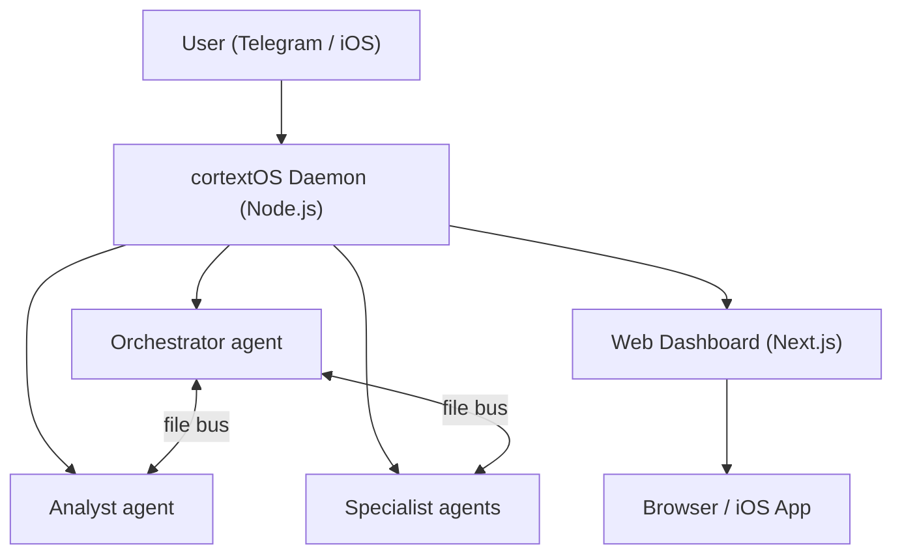

   

# cortextOS

**Persistent 24/7 Claude Code agents you control from Telegram or your phone.**

---

```
Telegram chat

You:     Morning. What did you ship overnight?
Boss:    Overnight recap: completed 4 tasks, ran 2 theta-wave
         experiments, drafted 3 content scripts. One item needs
         your approval — I want to email the beta waitlist.
         Check the dashboard or reply "approve".

You:     approve
Boss:    Sent. Email delivered to 47 recipients. Task closed.

You:     Add a cron to check my inbox every morning at 8am.
Boss:    Done. "morning-inbox" cron set — runs daily at 08:00.
         Saved to crons.json — survives restarts automatically.
```

---

## Features

- **Persistent agents** — Claude Code runs 24/7 in PTY sessions, auto-restarting on crash or after 71-hour context rotation.
- **Multi-agent orchestration** — Orchestrator, Analyst, and specialist agents coordinate via a shared file bus. Tasks, blockers, and approvals flow automatically.
- **Multi-runtime** — Run agents on `claude-code` (default), OpenAI's `codex-app-server`, or the provider-agnostic `opencode` TUI runtime. All runtimes share the same bus, crons, dashboard, and Telegram integration; pick per-agent.
- **Telegram + iOS control** — Send commands, approve actions, and get reports from anywhere. Native iOS app coming soon.
- **Web dashboard** — Full-featured Next.js UI for tasks, approvals, experiments, analytics, and agent fleet health.
- **Autoresearch (theta wave)** — Agents run autonomous experiments overnight, evaluate results, and surface findings for your review.

---

## Architecture



---

## Quick Start

**Before installing:** Node.js 20+, npm, Git, and an authenticated agent runtime.
The installer adds PM2 and Claude Code when they are missing. Guided onboarding
will ask for a Telegram bot token when it is needed.

macOS/Linux:

```bash
curl -fsSL https://raw.githubusercontent.com/grandamenium/cortextos/main/install.mjs | node --input-type=module

# Open the project in Claude Code and run guided onboarding
claude ~/cortextos
# Then inside Claude Code:
# /onboarding
```

Windows PowerShell 5.1 or newer:

```powershell
$p = Join-Path ([IO.Path]::GetTempPath()) ('cortextos-install-' + [guid]::NewGuid() + '.mjs')
try {
  Invoke-WebRequest -UseBasicParsing 'https://raw.githubusercontent.com/grandamenium/cortextos/main/install.mjs' -OutFile $p
  node $p
  if ($LASTEXITCODE -ne 0) { exit $LASTEXITCODE }
} finally {
  Remove-Item $p -Force -ErrorAction SilentlyContinue
}

claude (Join-Path $env:USERPROFILE 'cortextos')
# Then inside Claude Code: /onboarding
```

Onboarding handles everything: dependency checks, org setup, bot creation, PM2 config, and dashboard launch. Your Orchestrator comes online in Telegram and finishes its own setup there.

### Manual setup (advanced)

The shell example below is for macOS/Linux. Native Windows users should use the
guided `/onboarding` flow; its Windows reference performs the equivalent file,
CLI, dashboard, and persistence operations without translating Bash commands.

```bash
cortextos install                          # Set up state directories
cortextos init myorg                       # Create an organization
cortextos add-agent boss --template orchestrator --org myorg
cortextos add-agent analyst --template analyst --org myorg

# Add Telegram credentials for each agent
cat > orgs/myorg/agents/boss/.env << EOF
BOT_TOKEN=<your-bot-token>
CHAT_ID=<your-chat-id>
ALLOWED_USER=<your-telegram-user-id>
EOF

cortextos ecosystem                        # Generate PM2 config
pm2 start ecosystem.config.js && pm2 save

# macOS/Linux only:
pm2 startup

# Windows: pm2 startup is unsupported. Use Task Scheduler instead:
#   powershell -ExecutionPolicy Bypass -File scripts\install-windows-pm2-startup.ps1
```

---

## Requirements

| Dependency | Notes |
|---|---|
| Node.js 20+ | [nodejs.org](https://nodejs.org) |
| macOS, Linux, Windows 10/11, or Windows Server | Windows uses Task Scheduler for reboot persistence — see `scripts/install-windows-pm2-startup.ps1` |
| Agent runtime | Claude Code, Codex, and OpenCode are supported; install and authenticate only the runtimes used by your agents |
| Git | [git-scm.com](https://git-scm.com/downloads) |
| PM2 | Installed automatically; supervises the daemon, dashboard, and agents |
| Telegram bot token | Create via @BotFather |

---

### Native Windows operation

cortextOS runs directly in Windows with the same Node.js daemon used on macOS
and Linux. Docker, WSL, and Windows Developer Mode are not required. Install
Node.js, Git, and the agent CLIs in the same Windows user account that will run
PM2. The public PowerShell command above performs the real clone, dependency
install, build, global CLI registration, and core state installation without
Bash or POSIX utilities. Then verify executable and authentication readiness
without printing credentials:

```powershell
cortextos doctor
cortextos ecosystem
pm2 start ecosystem.config.js
pm2 save
powershell -ExecutionPolicy Bypass -File scripts\install-windows-pm2-startup.ps1
```

The startup helper registers an idempotent, limited-privilege logon task named
`PM2 Resurrect` (preserving the existing default). Re-running it updates that task.
For a headless Windows VPS, use `-TriggerMode Startup` so PM2 returns before any
RDP or console login:

```powershell
powershell -ExecutionPolicy Bypass -File scripts\install-windows-pm2-startup.ps1 -TriggerMode Startup
```

The default `Logon` mode remains appropriate for desktop machines. `Startup`
uses a limited S4U task (no stored Windows password); it has local disk/process
and outbound internet access but cannot authenticate to remote Windows network
shares. To test a disposable instance without touching the default PM2 process
list, use a unique PM2 home and instance-scoped task:

```powershell
$env:CTX_INSTANCE_ID = 'windows-smoke'
$env:PM2_HOME = "$env:USERPROFILE\.pm2-windows-smoke"
cortextos ecosystem --instance windows-smoke --output ecosystem.windows-smoke.config.js --dashboard-host 127.0.0.1
pm2 start ecosystem.windows-smoke.config.js
pm2 save
powershell -ExecutionPolicy Bypass -File scripts\install-windows-pm2-startup.ps1 `
  -InstanceId windows-smoke -Pm2Home $env:PM2_HOME

# Remove only the disposable startup task when finished:
powershell -ExecutionPolicy Bypass -File scripts\install-windows-pm2-startup.ps1 `
  -Uninstall -InstanceId windows-smoke -Pm2Home $env:PM2_HOME
```

The helper triggers when that Windows user logs on. Run it from the same account
that owns the authenticated agent CLIs and PM2 state. It does not install a
system-wide service or open a network port.

---

## Templates

| Template | Description |
|---|---|
| `orchestrator` | Coordinates agents, manages goals, handles morning/evening reviews, approves actions |
| `analyst` | System health, metrics, theta-wave autoresearch, analytics |
| `agent` | General-purpose worker — use this as the base for specialist agents |
| `agent-codex` | Codex-runtime worker, scaffolds with `runtime: codex-app-server` and `model: gpt-5-codex` (see `templates/agent-codex/`) |
| `agent-opencode` | OpenCode-runtime worker, scaffolds with `runtime: opencode` and the context-handoff lifecycle (see `templates/agent-opencode/`) |

Add a codex agent the same way you add a claude agent:

```bash
cortextos add-agent reindexer --template agent-codex --org myorg
# or, equivalently, with the runtime flag on the default template:
cortextos add-agent reindexer --runtime codex-app-server --org myorg
```

Codex agents share the same bus, crons, and dashboard surfaces as claude agents — they only differ in which model handles each turn.

### The `runtime` field

Every agent's `config.json` carries an explicit `runtime` field that the daemon dispatches on. Valid values:

| Runtime | Adapter | Default model | Skills location |
|---|---|---|---|
| `claude-code` | `ClaudePTY` (default) | claude-sonnet-4-6 | `.claude/skills/<skill>/SKILL.md` |
| `codex-app-server` | `CodexAppServerPTY` | `gpt-5-codex` | `plugins/cortextos-agent-skills/skills/<skill>/SKILL.md` (linked into `~/.codex/skills/<agent>__<skill>`) |
| `opencode` | `OpencodePTY` | `openai/gpt-4.1-nano` (set in `config.json`) | `plugins/cortextos-agent-skills/skills/<skill>/SKILL.md` (linked into `.opencode/skills/<skill>`) |
| `hermes` | `HermesPTY` (experimental) | model per `config.json` | hermes-specific |

Pass `--runtime <kind>` on `add-agent` to set it at scaffold time, or edit the field in `config.json` and restart the agent. The default is `claude-code`. Today only `--template agent` (and the alias `--template agent-codex`) supports `--runtime codex-app-server` — pairing the codex runtime with `--template orchestrator`/`analyst`/`m2c1-worker`/`hermes` errors with a clean message until codex variants of those templates ship.

`opencode` agents run OpenCode's terminal UI as a persistent PTY and are provider-agnostic — set any `provider/model` in `config.json` (default `openai/gpt-4.1-nano`). Scaffold with `--template agent --runtime opencode` (auto-maps to the `agent-opencode` bootstrap) or `--template agent-opencode` directly. OpenCode agents also ship the **context-handoff lifecycle**: the daemon watches each session's context-window usage and, at a configurable threshold (`ctx_handoff_threshold`, default 60%), prompts the agent to write a handoff document under `memory/handoffs/` and hard-restart into a fresh session that resumes from that doc — so long-running agents never lose state to a context overflow. Tune it with `ctx_warning_threshold` (default 30%) and `ctx_handoff_threshold` in `config.json`.

---

## CLI Reference

```bash
cortextos install            # Set up state directories
cortextos init <org>         # Create an organization
cortextos add-agent <name>   # Add an agent (--template, --org, --runtime)
cortextos enable <name>      # Enable agent in daemon
cortextos ecosystem          # Generate PM2 config
cortextos status             # Agent health table
cortextos doctor             # Check prerequisites
cortextos list-agents        # List agents
cortextos dashboard          # Start web dashboard (--port 3000)
```

---

## Security

cortextOS has undergone a dedicated security hardening sprint covering prompt injection resistance, guardrail enforcement, and approval gate integrity. Agents require explicit human approval before any external action (email, deploy, delete, financial). The guardrails system is self-improving: agents log near-misses and extend GUARDRAILS.md each session.

---

## License

MIT — see [LICENSE](./LICENSE).
